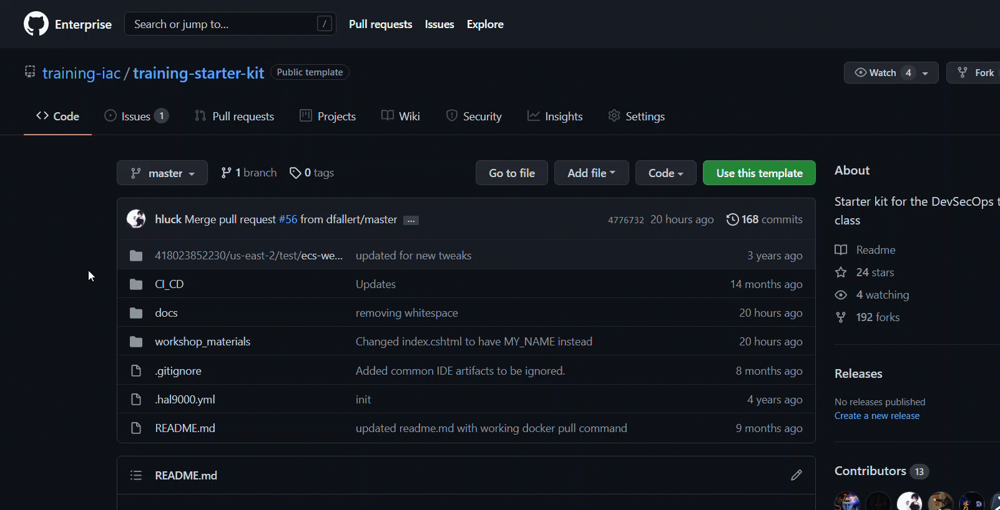
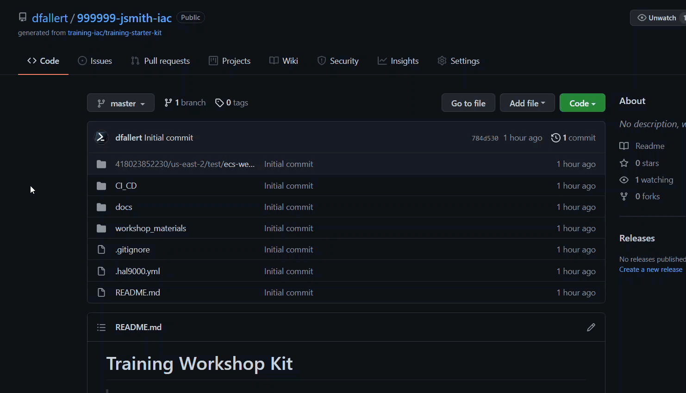

# Training Workshop Kit

> [Docker ](https://www.docker.com) : Open platform for developers and sysadmins to build, ship, and run distributed applications as containers, whether on laptops, data center VMs, or the cloud.

> [CircleCI ](https://circleci.foc.zone/gh/Servicing/dolphin-api) : Continuous Integration (CI) and Continuous Deployments (CD) tool

> [AWS Elastic Container Service (ECS) ](https://aws.amazon.com/ecs/) : Orchestration of Docker containers on EC2 instances. This runs the code, auto-scales containers and the EC2's they run on up and down, as well as handling the infrastructure side of deploying new code.

> [HAL9000 ](https://hal.zone/applications/933/dashboard) : QL in-house application that handles deployments and releases to various environments (including AWS). It also handles a lot of the encrypted configuration values which are passed to the code as Environment Variables.

> [Terraform ](https://www.terraform.io/) : Terraform is Infrastructure-As-Code (IAC) that can build out highly QL-specific infrastructure components in a repeatable way. Instead of a lot of click-and-configure, we can run terraform scripts to create approved infrastructure stacks on-demand in minutes.

# Prerequisites

**These are the prereqs which are needed prior to coming to a workshop. The following should be completed and ready to go:**

- Docker installed locally ( **Install through Software Center (PC) or Self Service (Mac)** - If you install from the Docker web site, you will be missing key network policies needed )
    * If using a Windows PC, make sure right-click the Docker icon in your system tray and make sure it's set to use LINUX containers. In other words, it should show "Switch to Windows containers", which means it's currently on Linux containers.
    * Once the above steps are complete (regardless of operating system), open a command prompt/terminal window, enter the following command, and wait for it to complete: "docker pull mcr.microsoft.com/dotnet/sdk:7.0". **Verify this steps works prior to the class**
- VSCode or similar file editor ( https://code.visualstudio.com/download )
- Install the `AWSCLI` ( https://docs.aws.amazon.com/cli/latest/userguide/install-cliv2.html )
    * Go to a command prompt, type in **aws configure**. Hit enter for the first 2 lines, enter "us-east-2" for the region, then enter again. This will create an **.aws** folder under your user folder with configuration files for the cli.
    * Due to our network firewall, you need to add the QL certs into the certificate chain so the awscli can properly communicate with AWS. Go here: https://git.rockfin.com/raw/sudoers/ssm-instance-connect/master/files/qlcerts.pem, download that file to your **~/.aws/** folder. Add the following "ca_bundle" line to your ~/.aws/config file:
      * ON WINDOWS
        ```
        [default]
        region = us-east-2
        ca_bundle = C:/Users/YOURNAME/.aws/qlcerts.pem
        ```
      * ON MAC
        ```
        [default]
        region = us-east-2
        ca_bundle = /Users/YOURNAME/.aws/qlcerts.pem
        ```
    Verify the AWS CLI is installed and functioning properly by opening a terminal of your choice and typing `aws --v`.  You should get a response similar to `aws-cli/2.2.0 Python/3.8.8 Windows/10 exe/AMD64 prompt/off`
- Install the SAML to AWS STS Keys Conversion Plugin
    * This will allow you to assume the role of the AWS account you requested access to. 
    * In Google Chrome enable the plug in located here [STS to SAML](https://chrome.google.com/webstore/detail/saml-to-aws-sts-keys-conv/ekniobabpcnfjgfbphhcolcinmnbehde?hl=en)
    * Add an environment variable for the credentials file that will be downloaded to your downloads folder.
      * ON WINDOWS
        ```
        Open Powershell with run as administrator and run: 
         * Make sure to replace the downloads path with your correct one 

        [System.Environment]::SetEnvironmentVariable('AWS_SHARED_CREDENTIALS_FILE','C:\Users\YOURNAME\OneDrive - Knex\Downloads\credentials',[System.EnvironmentVariableTarget]::Machine)
        
        ```
      * ON MAC
        ```
        Open terminal and run:
        ln -s ~/Downloads/credentials ~/.aws
        ```

- Request AWS account access to Training Lab Account (418023852230). Navigate to myaccess/ in your browser, click "Add/Remove Access", and search for `AWS-SSO-TrainingIAC-NonProd-ServerEngineer`. Click the checkbox and request it for your **dash account**. Then click "Review and Submit", then "Submit".
- Install `Terraform` ( https://www.terraform.io/ )
    * If using a Windows PC, wherever you download Terraform to, make sure to add that path to your PATH variable. See here for how: https://helpdeskgeek.com/windows-10/add-windows-path-environment-variable/
    * If Mac, see here: https://web.archive.org/web/20211129103912/https://osxdaily.com/2014/08/14/add-new-path-to-path-command-line/
    * Effectively, you want to be in any folder on your computer and be able to call that binary. To test, go to the command line of your OS and type "terraform version": you should get the version back. If not, see someone from IT Team Sudo.
- Install `Git` to your desktop. This can be done via Software Center (on Windows).
- Using this repo as a template, create your own via the `Use this template` button. ( see below for details )
- If you've never used HAL before, go to https://hal.zone/ in your browser and login with your dash account. This will create your account in HAL.
- You may also need `Postman` or a similar tool for testing network/api calls.
  

## Setting Up Your Github Repository

1. At the top of this repository ( https://git.rockfin.com/training-iac/training-starter-kit.git ) click the green button that states `Use this template`

2. On the next page, under `Repository name` enter `999999-yourname-iac`, where `yourname` is your AD network login (first initial, last name).

3. Ensure that the `Public` radio button is selected

4. Click on the green `Create repository from template` button. <details>
    <summary>Show me!</summary>
      
      
    </details>

5. Clone the newly created repository <details>
    <summary>Show me!</summary>
      
      
    </details>
