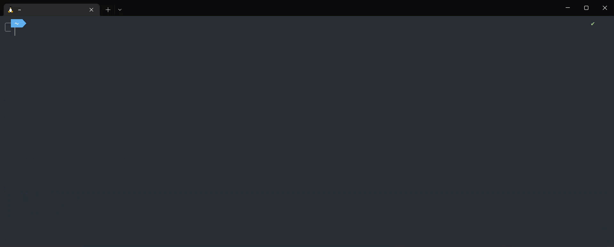
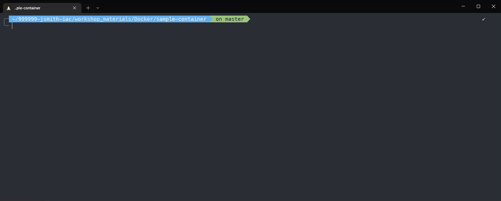
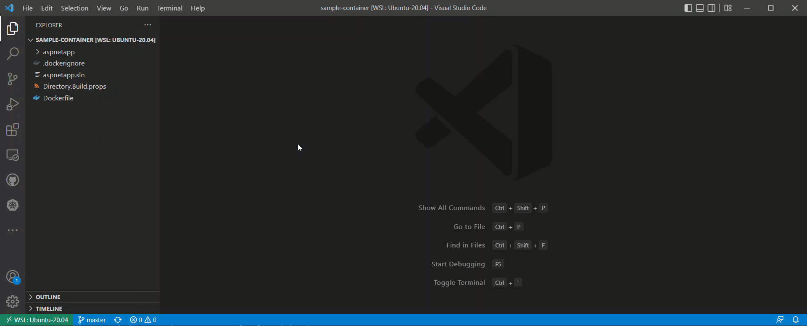
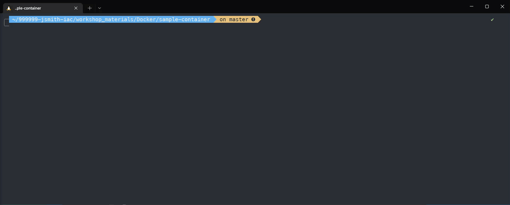
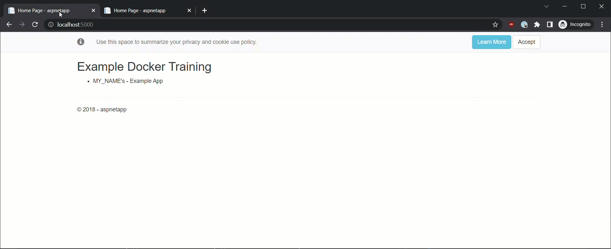

# Docker Lab
## Some Initial Setup
---

Navigate to `999999-YOURNAME-iac/workshop_materials/Docker/sample-container` (`999999-YOURNAME-iac` is the repo you created per the pre-requisites.)

This can be done on most, if not all operating systems via the `cd` command

```Bash
cd 999999-YOURNAME-iac/workshop_materials/Docker/sample-container
```

<details>

  <summary>Show me!</summary>

  

</details>


## Build
---

In order to run a container, we'll need an image.

After navigating to the `sample-container` folder outlined in the previous section, we can now build our image. 

To build container images, we'll be using the `docker build` command.

In your terminal, run `docker build -t my-local-training-image -f Dockerfile .`

To further break this command down:
- `docker`: The docker binary
  - `build`: The command sent to the docker binary, telling it to build an image
    -  `-t`: An option for `docker build` That allows us to name and optionally a tag in the 'name:tag' format
    -  `-f`: An option for `docker build` That allows us to designate the name of the Dockerfile. By default, it is `Dockerfile`. This option is included here for learning purposes, but can be omitted.
    - `.`: Because `docker build` requires a path to build from, we're using `.` which says, "look in my current directory".  


<details>

  <summary>Show me!</summary>

  

</details>

## Run
---

After building our image, we can now run a container using that image. To do this, we'll be using the `docker run` command.

In your terminal, run `docker run -d -p 5000:80 my-local-training-image`

To further break this command down:
- `docker`: The docker binary
  - `run`: The command sent to the docker binary, telling it create and run a container
    -  `-d`: An option for `docker run` That allows us to run our container "detached", meaning it's running as what is essentially a background process. If this option is omitted, it will attach to your terminal's stdout.
    -  `-p`: An option for `docker run` That allows us to configure the ports for our container. The syntax is `HostPort:ContainerPort`
    - `my-local-training-image`: Because `docker run` requires an image in order to create the container, we're designating it here, using the "human-readable" name. We can also use the image ID if we want.  


Now in your browser of choice, browse to http://localhost:5000

<details>

  <summary>Show me!</summary>

  

</details>

## Customize
---

Now that we've built an image, and ran a container using that image, let's look at making some customizations to the image.

In your chosen IDE, modify the file located at `workshop_materials/Docker/sample-container/aspnetapp/Views/Home/Index.cshtml`, by replacing `MY_NAME` with your username. (Or anything really, as it's arbitrary.)

<details>

  <summary>Show me!</summary>

  

---
</details>

<br>

After customizing that file, we're going to build an image like before, except this time, we're going to explicitly tag our new version. In the earlier breakdown of the `docker build` command's `-t` option, we can see that the syntax of the tag is 'name:tag' where explicitly adding `:tag` is optional. If `:tag` is omitted, then docker automatically tags the image with `:latest`. Because we don't want to overwrite `:latest`, we'll be explicitly tagging the image with `:2.0`.

In your terminal, run the following commands:
```Bash
docker build -t my-local-training-image:2.0 -f Dockerfile . 
docker run -d -p 5001:80 my-local-training-image:2.0
```

<details>

  <summary>Show me!</summary>

  
  
---
</details>

<br>

> _**Note**_:
Keep an eye on the port number, as it has changed. If we don't increment the port, and the previous container is still running, we'll get an error stating that the port is already in use.

Now we can browse to http://localhost:5001​ and http://localhost:5000 to compare websites.

<details>

  <summary>Show me!</summary>

  
  
---
</details>
