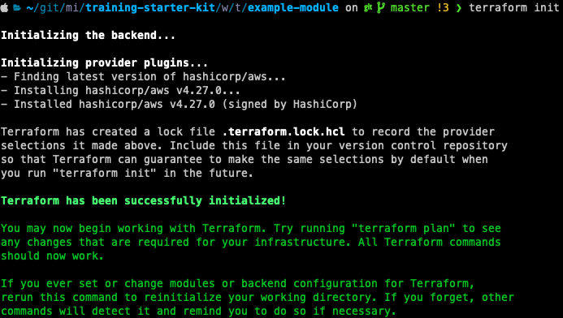
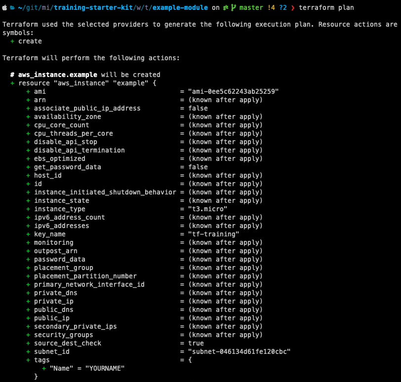
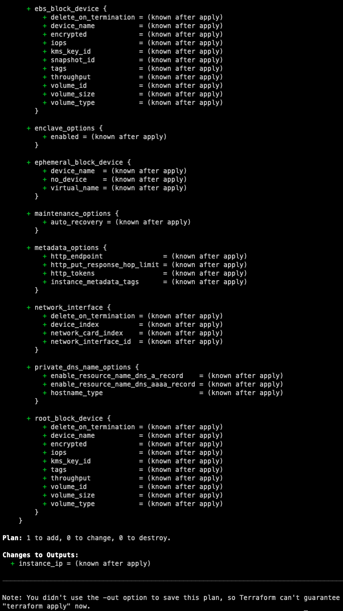
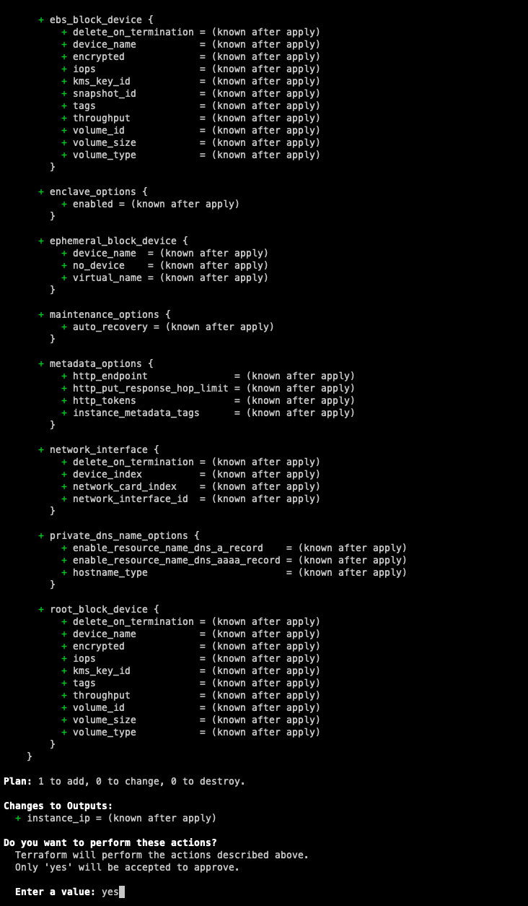
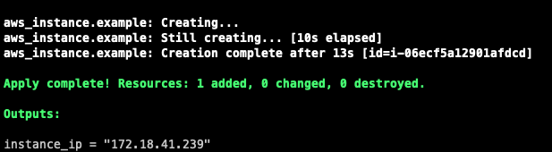
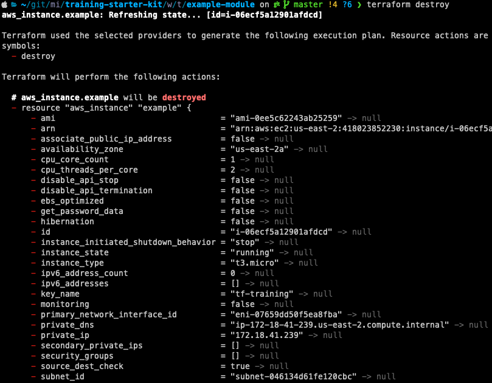
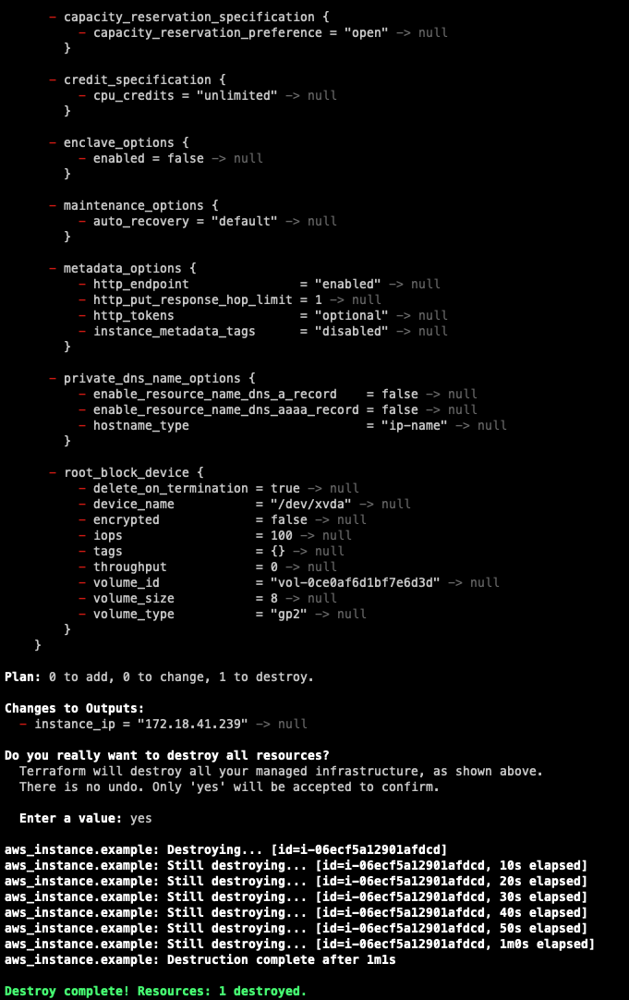

# Lab #1

1. Navigate to your training kit folder `workshop_materials/terraform/example-module`. We're going to edit the following files to populate them with terraform syntax:

main.tf
---

2. Open the main.tf file and populate it with the following items:

**Providers**

- AWS provider (hint: [see here](https://registry.terraform.io/providers/hashicorp/aws/latest/docs#example-usage))
  - This should pull the aws_region from `variables.tf` using the `var.aws_region` syntax.

**Data sources**

- Most recent linux AMI owned by amazon (hint: [see here](https://registry.terraform.io/providers/hashicorp/aws/latest/docs/data-sources/ami))
- Private subnet in AZ1 (hint: [see here](https://registry.terraform.io/providers/hashicorp/aws/latest/docs/data-sources/subnet#filter-example) and filter by tags for the name `vpc-*-private-az1`

**Resources**

- AWS EC2 Instance (hint: [see here](https://registry.terraform.io/providers/hashicorp/aws/latest/docs/resources/instance#basic-example-using-ami-lookup))
   - Should pull instance type from `variables.tf` using the `var.instance_type` syntax.
   - Should pull the name of the instance using the application name from `variables.tf` using the `var.application_name` syntax.
   - Should pull the AMI ID from the AMI looked up in the data sources section above.
   - Should pull the subnet ID from the subnet looked up in the data sources section above.


<details>
 <summary>Click to see solution</summary>
  
```hcl
terraform {
  required_providers {
    aws = {
      source  = "hashicorp/aws"
      version = "~> 4.0"
    }
  }
}

provider "aws" {
  region = var.aws_region
}

data "aws_ami" "example" {
  most_recent      = true
  owners           = ["amazon"]

  filter {
   name   = "name"
   values = ["amzn2-ami-hvm*"]
 }
}

data "aws_subnet" "example" {
  filter {
    name   = "tag:Name"
    values = ["vpc-*-private-az1"]
  }
}

resource "aws_instance" "example" {
  ami                         = data.aws_ami.example.id
  instance_type               = var.instance_type
  subnet_id                   = data.aws_subnet.example.id

  tags = {
    Name = var.application_name
  }
}
```  
  
</details>

## variables.tf

3. Next we'll establish the variables being used in the main.tf.  Let's add the following to the variables.tf file:

- `aws_region`
- `application_name`
- `instance_type`

None of these should have defaults, descriptions or type constraints.


<details>
 <summary>Click to see solution</summary>
  
```hcl
variable "aws_region" {}  
variable "application_name" {}
variable "instance_type" {}
```
 
 </details>

## outputs.tf

4. Next, we'll set the values for the following output variable:

- `instance_ip` - This should pull the `private_ip` attribute from the `aws_instance resource


<details>
 <summary>Click to see solution</summary>   

```hcl
output "instance_ip" {
  value = aws_instance.example.private_ip
}
```
 
</details>
 
## terraform.tfvars

5. Now we need to define the variables in a variable input file: terraform.tfvars  

Set the values for the following variables defined previously:

- `aws_region`
- `application_name` (this should be YOURNAME)
- `instance_type`


<details>
 <summary>Click to see solution</summary>   

```hcl
aws_region       = "us-east-2"
application_name = "YOURNAME"
instance_type    = "t3.micro"
```

**Make sure you replace YOURNAME**
 
</details>

Deploying Your Infrastructure
------
As part of the prerequisites, you should have configured AWS CLI access. If you've not done so already, [click here](../../README.md#prerequisites) for instructions.

Deploy Module
------

Once configured, make sure your command line is in the `workshop_materials/terraform/example-module` directory and run the following commands:    

```
terraform init 
```



This command initializes the working directory for terraform use.  If you see a prompt similar to the image above, proceed to the next step:

```
terraform plan 
```




This details what resources and configurations will be deployed.  If something doesn’t look right, review your .tf files from the steps above, make any necessary corrections and run the plan again.  Once the plan looks good, proceed on to running the apply: 

```
terraform apply  
```




The output here should be identical to the output from the plan, but now we have the option to enter a prompt to deploy the infrastructure. Enter “yes” (**must be all lowercase** to deploy the infrastructure.   

After you've verified the instance is up with your desired configuration, come back to the terraform.tfvars file and change the instance type from t3.micro to t3.small.  Run through the plan and apply steps again to deploy the configuration change.  
  

Destroying Your Infrastructure
------

The last step is to clean up our infrastructure once we've verified it deploys correctly.  
  
To destroy the infrastructure, from the Terraform configuration root directory, run:
  
```
terraform destroy
```  




Like the apply command, the destroy will output each resource it is going to destroy and prompt for confirmation before doing so.  If everything looks as expected, enter "yes" and destroy the infrastructure. 
