# Lab 2

For this lab we will use HAL deploy infrastructure into AWS that will run your container from the first class inside an ECS Cluster. Note that this will just be laying down the base infrastructure to run your container, but won't actually put the container there itself.  We will do that in the final class (CircleCI/HAL) but for now, let's get the infrastructure stood up.

First, if you haven't created the "999999-YOURNAME-iac" repo yet under your own personal profile, you will want to follow the directions [HERE](../../README.md#setting-up-your-github-repository)) to set up GIT

Once done, follow the instructions below for setting up a HAL application to deploy your infrastructure with Terraform.

## Configure Terraform Module

- Navigate and open the local file in your cloned repo: `418023852230/us-east-2/test/ecs-website/terraform.tfvars`
- Check for the latest version of the ecs-website module [here](https://git.rockfin.com/training-iac/training-ecs-website/releases).

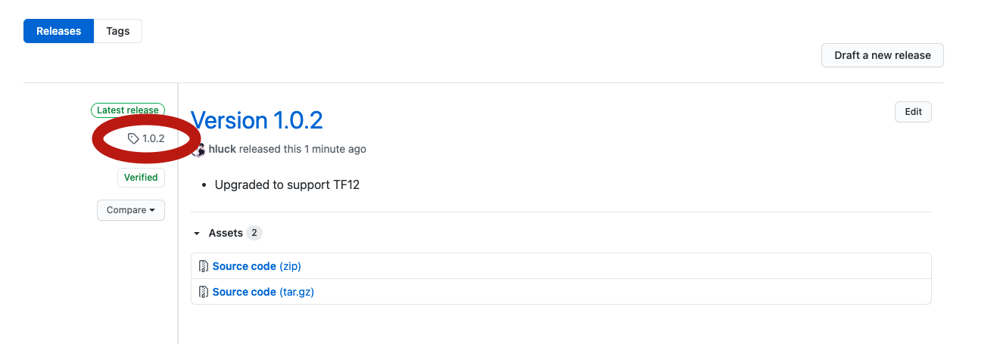

- Update your `terraform.tfvars` with the latest tagged release and your name:
  
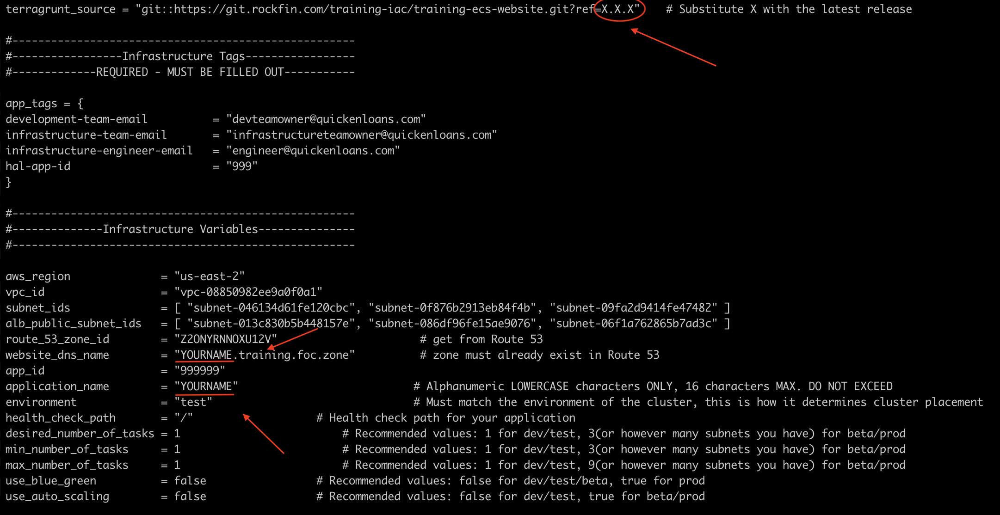

## Setting up HAL

Login to Hal here: https://hal.zone/signin using the same account you logged into AWS with (most likely, this will be your dash account).

### Add Your Application

- **Fill out the dialog boxes with the relevant information:**
    * Name: YOURNAME-iac
    * Organization: IAC Training
    * GitHub Repository: Link to the Git repo you created prior to the workshop
    * Provider: AWS
    * Platform: Infrastructure as Code
    * Language: Terraform

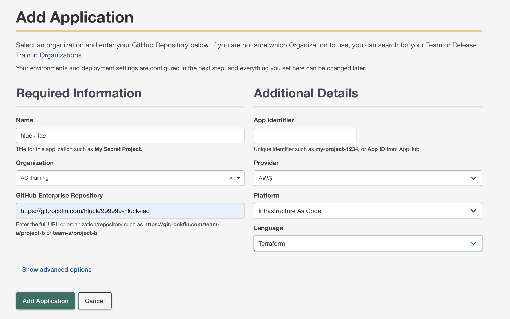

### Add Deployment Targets
- Deployment config is required for each environment.
      It is required to **Deploy** and **apply terraform changes**.
- Select configure under Terraform

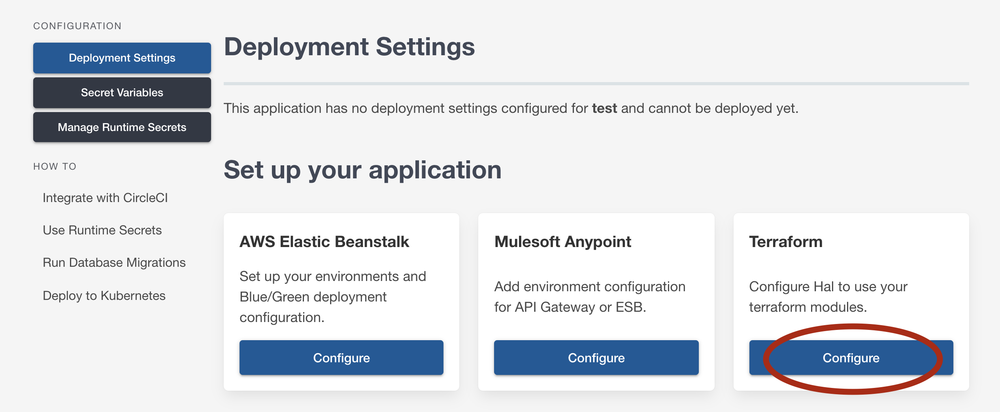

- Version: 0.12.x
- Environments: `test-aws` and `beta-aws`
- Module name: `ecs-website`
- Click "Add Deployment Settings"

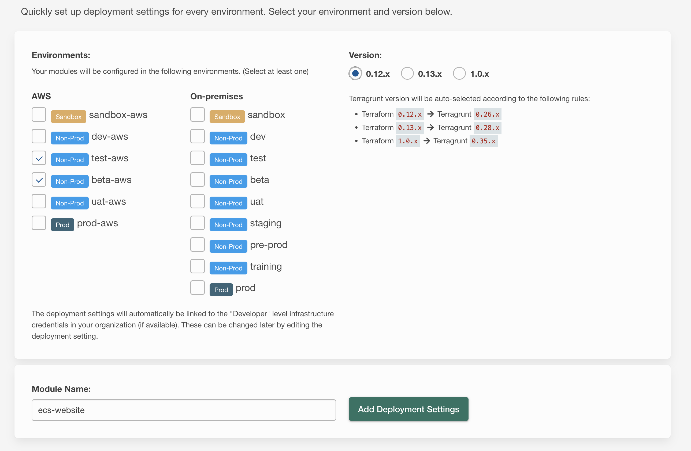

- The default credentials assigned to our deployment aren't enough. Let's edit the deployment and change them
  
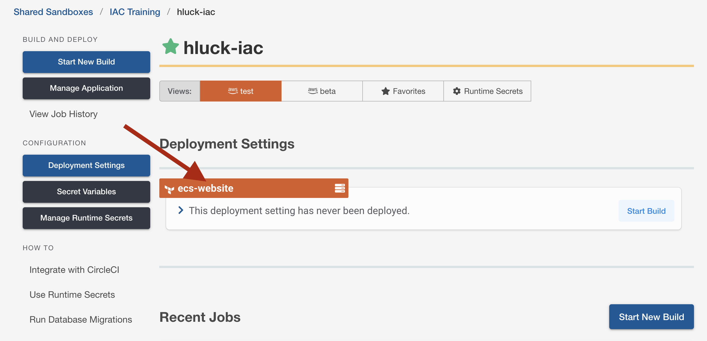
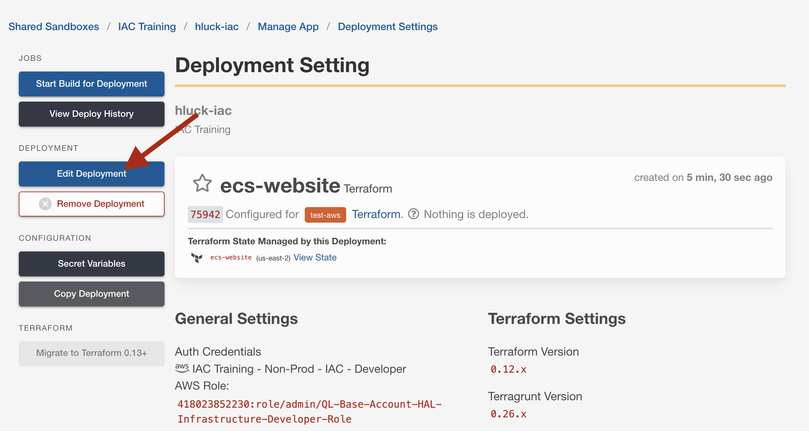

- Change the Authentication option to `IAC Training - Non-Prod - IAC - Admin (AWS Role)`
  
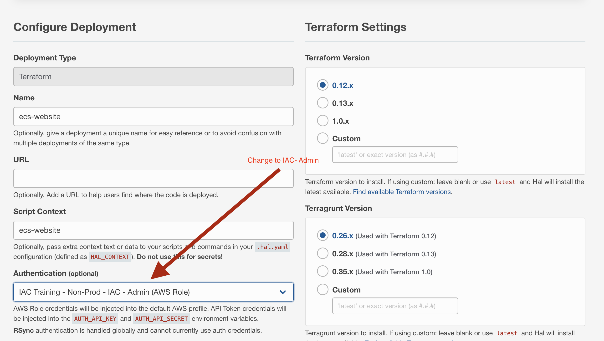

## Build and Deploy Infrastructure

### HAL Build (Terraform Plan)

To build (see below), go to Application Dashboard > Start New Build. Select your branch (typically master), **fill out the module and region parameters** (ecs-website and us-east-2, for our example), then Start Build! What the module and region parameters basically do is tell HAL how to navigate the folder structure you have in Git, so that it can find the correct module under the correct region.

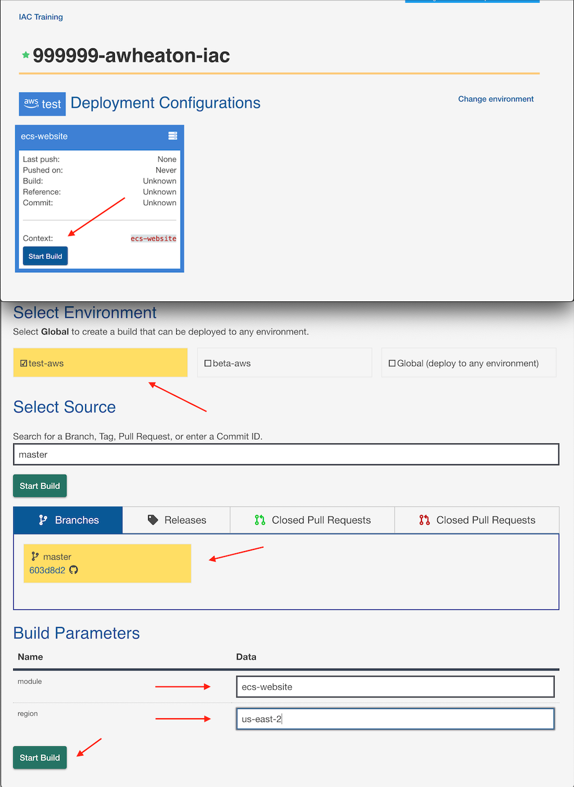

### Terraform Plan

This will do a "terraform" plan command, which will basically tell you what terraform is GOING to do, but not actually do just yet.

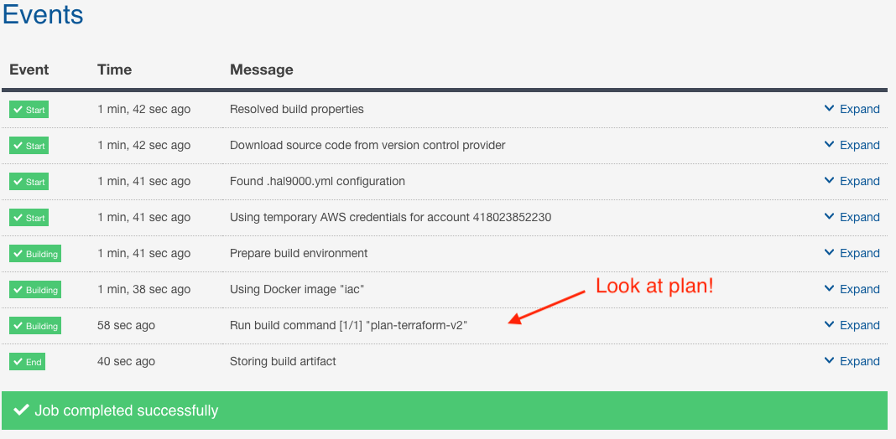

### Review Output and Apply

Once you review the output and verify that the plan is what you want and all the variables look correct, click "Deploy Build" then "Push Infrastructure" to run a "terraform apply" and deploy the infrastructure!  This should look similar to the process below.

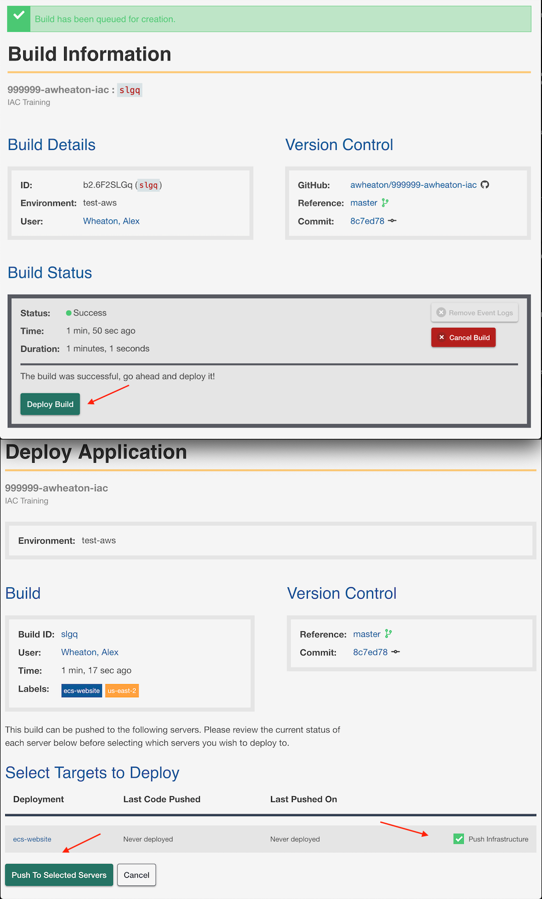

### Review Output

Similar to how to look at the Terraform plan, you can look at the terraform apply output and eventually the outputs themselves, in the same manner.

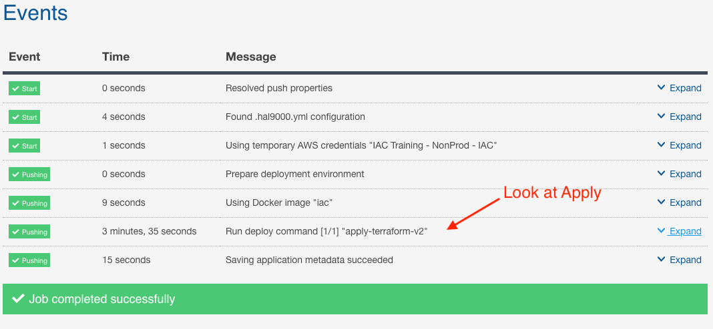

### Success

This is what a successful Build, Apply should look like for this lab:

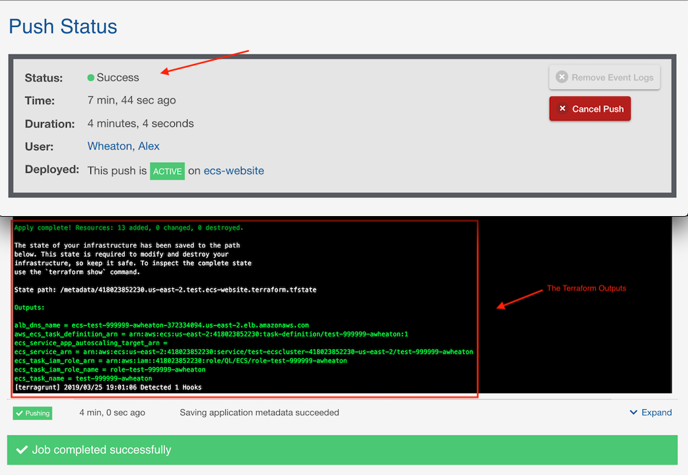

### Now BETA

Now go back through and see if you can get a BETA environment setup!
